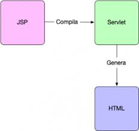

# JDBC basics

Life cycle of a servlet has 3 steps:

1. init()
1. service()
1. destroy()

*A servlet is a **java program** that allows us to develop dynamic web applications, they have APIs.*

<!---->

web browser <-------> servlet <-----> DB  
:::::::::::::::::::::::::::::::::::::. web container::::::::::::::::::::::::::::::::::::::::::

servlets have __@anotations__ , they are defined in a _web.xml_.  

